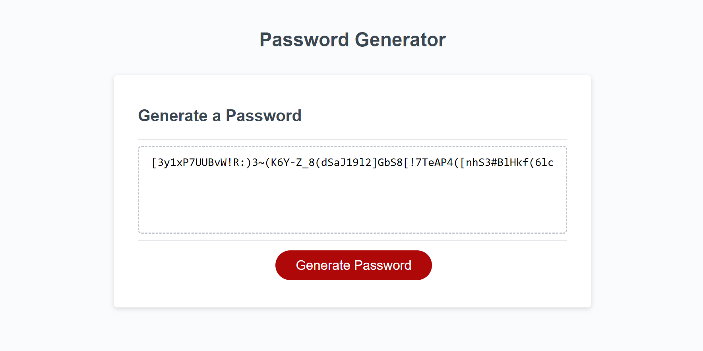

# Password Generator

## Description

- A simple Javascript app, looping through multiple character arrays to display a randomly generated password upon prompt.

- With User input, the generator will generate according to specified selections

- Making use of functions, this app prints the generated password to the browser

- Although difficult, this challenge was eye opening

- Tried to make use of my code, I did not want to repeat myself which seems easy to do with if else statements.

## Installation

N/A

## Usage

Open index.html in the browser, press the generate password button and follow the prompts!

## Credits

- The Bootcamp lot
- Wes Bos
- WS3 Schools
- https://developer.mozilla.org/

## License

MIT License

## Link

- https://github.com/nattytatat/Password-Generator/

- https://nattytatat.github.io/Password-Generator/